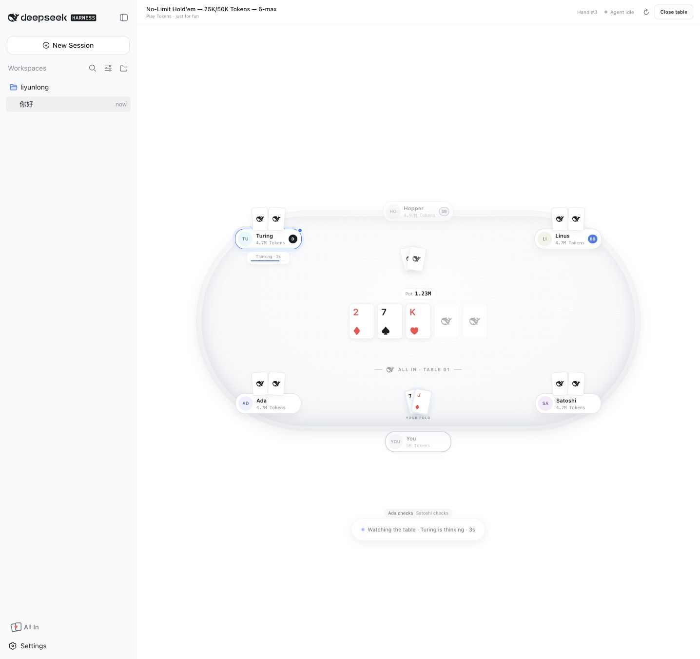

# dsh-all-in

**Your agent is thinking. You're all in.**

Play a fast, local-only six-max Texas Hold'em hand while DeepSeek Harness is thinking.



`dsh-all-in` adds an **All In** action to the Harness sidebar and opens a full-screen poker table through the supported `shell.overlay` slot. The active agent keeps running underneath it. The game never writes to the conversation, calls a model, or uses a network connection.

> Entertainment only. Tokens have no monetary value. There are no deposits, withdrawals, purchases, accounts, or multiplayer wagering.

## What works

- Six seats: one human and five local bots
- Pre-flop, flop, turn, river, showdown
- Fold, check, call, pot-sized raise, and all-in
- 5M Token starting stacks with 25K/50K blinds
- Seven-card hand evaluation and split pots
- Side-pot settlement for unequal all-in contributions
- Persistent local Token stacks across page reloads
- Live **Agent thinking / Agent idle** status
- English and Simplified Chinese UI
- Responsive desktop and narrow-window layouts

## Install

From the prebuilt GitHub Release:

```sh
dsh plugin --profile web add https://github.com/leeclouddragon/dsh-all-in/releases/download/v0.1.0/dsh-all-in-0.1.0.tgz
dsh --profile web
```

From npm after the first npm release:

```sh
dsh plugin --profile web add dsh-all-in
dsh --profile web
```

From a local checkout:

```sh
git clone https://github.com/leeclouddragon/dsh-all-in.git
cd dsh-all-in
pnpm install
pnpm check
dsh plugin --profile web add "$PWD"
dsh --profile web
```

For a GitHub source install, DeepSeek Harness uses pnpm's git dependency flow. The package has a `prepare` script that builds `lib/`; pnpm 10+ requires users to allow that build explicitly. Publishing prebuilt artifacts to npm avoids that prompt.

## Development

```sh
pnpm install
pnpm check
```

The package has two halves:

- `lib/index.js`: a no-op host plugin that activates the bundle
- `lib/client.js`: a browser bundle registering `sidebar.footer.action` and `shell.overlay`

The poker engine is independent of React and exported as `dsh-all-in/engine` for tests and future bot strategies.

## Why this is a separate repository

DeepSeek Harness is currently in developer preview and its contribution guide says external pull requests are not accepted yet. The official ecosystem path is an independent plugin repository tagged with the GitHub topic [`dsh-plugin`](https://github.com/topics/dsh-plugin).

## License

MIT
